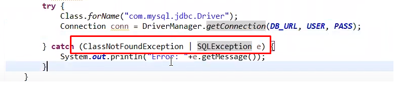
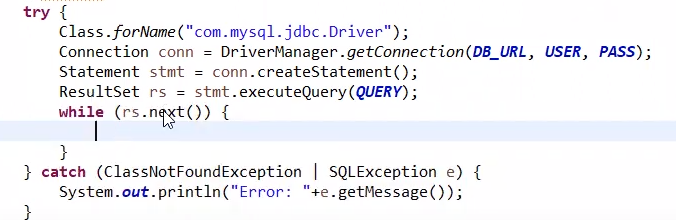
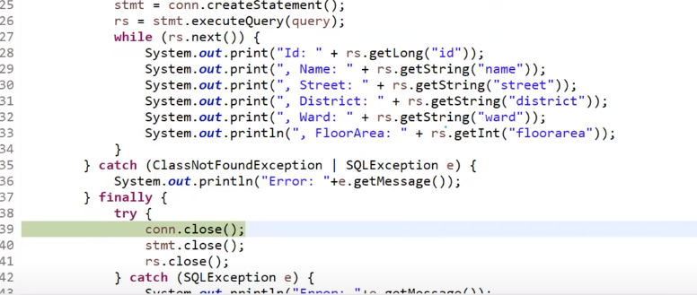
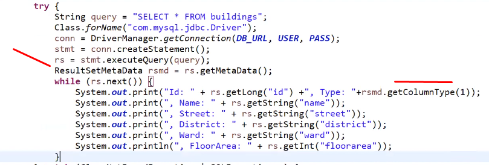
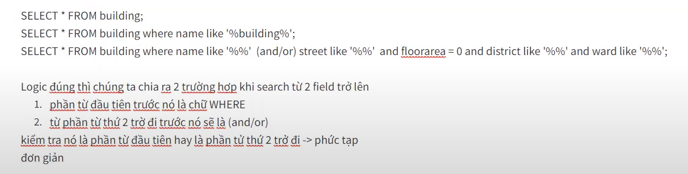

# JBDC

## Bài 1
- JDBC là 1 kỹ thuật kết nối giữa JAVA và CSDL (MySQL, SQL Server,...)
  + Lấy dữ liệu
  + Thao tác dữ liệu xuống
- Driver giữa MySQL và JAVA (file jar)
- Giới thiệu về Exception (lỗi không mong muốn, không kiểm soát được)
  + Unchecked exception : Biên dịch thì lỗi luôn
  + Runtine exception : Chạy xong mới báo lỗi (VD: 10/0)
- Dùng try...catch... để bắt exception
## Bài 2
- Có 1 Exception cha ở cuối để bắt ngoại lệ nếu như chưa biết cụ thể đó là ngoại lệ gì
- Debug cơ bản
- Lấy dữ liệu lên : 
  + Load driver
  + Tạo connection
  + Khởi tạo đối tượng statement
  + Thực thi câu SQL
  + Xử lý data và trả về sau khi thực thi
- Multiple catch để xử lý nhiều Exception
  + 
- JDBC 
  + Statement : 
    * Sau khi excute SQL trả data ra ResultSet
    * rs.next() kiểm tra row đó tồn tại hay không ?
    * 
  + PreparedStatement
## Bài 3
- Get data kèm theo data type
- getObject() : không xác định được kiểu dữ liệu cần lấy
- finally : luôn chạy cuối cùng dù có lỗi hay không (close connection)
  + 
## Bài 4
- ResultSet không xử lý được dùng ResultSetMetaData :
  + Chỉ biết tên column chưa biết kiểu dữ liệu
      * 
- Vấn đề search từ 2 field trở lên
    + 
## Bài 5
- SELECT * FROM building có kết quả tương tự SELECT * FROM building WHERE 1 = 1 (ko cần care đến việc check phần tử đầu tiên để thêm WHERE)
- StringBuilder (tiết kiệm bộ nhớ)